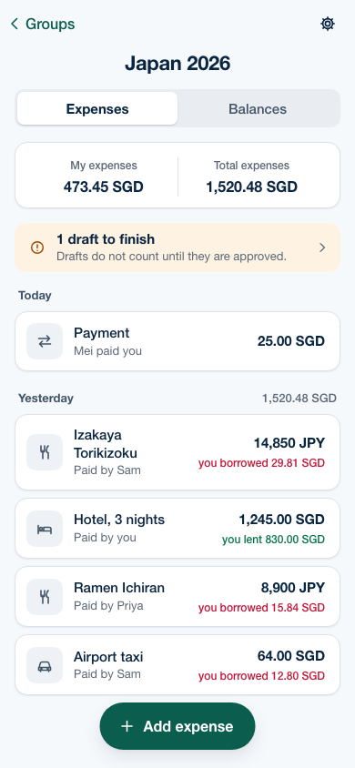
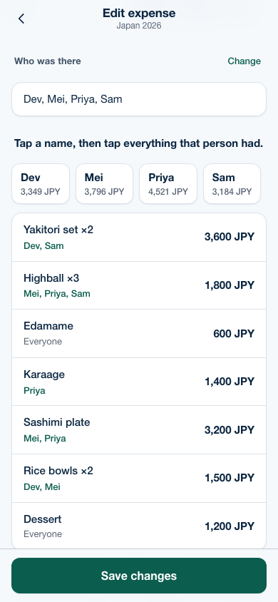
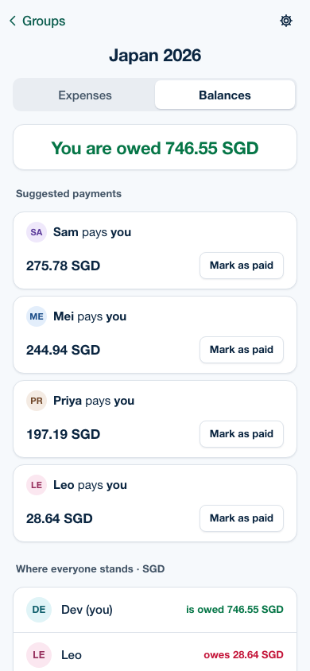
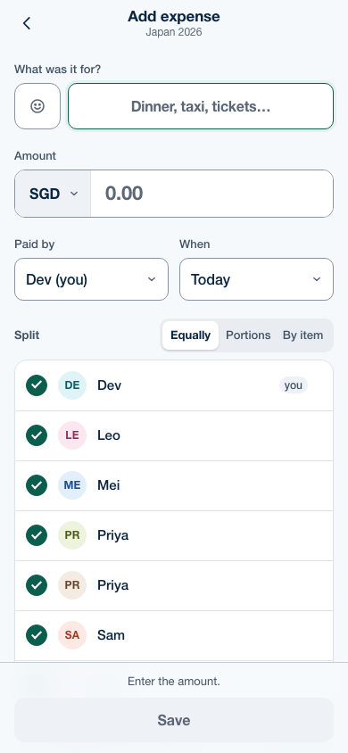
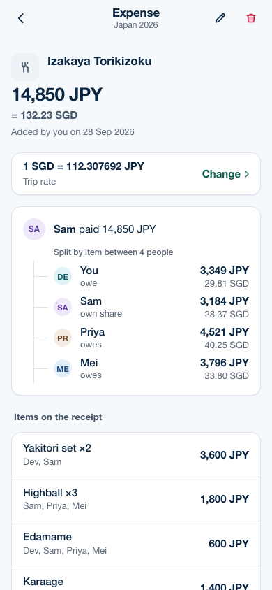
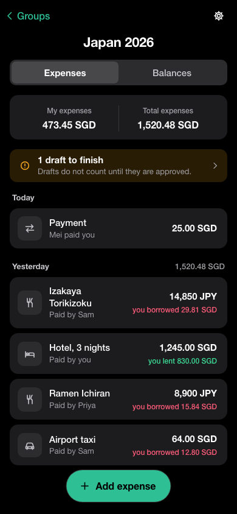

# TripSplitter

Split trip expenses without leaving your Telegram group. Add the bot to the chat, snap a receipt, and everyone sees who owes whom.

<p>
  
  
  
</p>
<p>
  
  
  
</p>

## What it does

- **Lives in the group chat.** Add the bot to a Telegram group and it sets up the trip, learns who is in the group, and posts a short note whenever something changes.
- **Reads receipts.** Post a photo with the bot's name in the caption, or send it to the bot privately. It reads the merchant, total, currency and line items into a draft for someone to approve. Booking and order confirmations work too.
- **Splits three ways.** Equally, by portions, or by item, with a counter per person for shared dishes ("Sam had 2 of the 3 beers").
- **Handles currencies.** Twelve currencies, with the live mid-market rate looked up when a trip has none, one fixed rate per trip, and an optional rate per expense.
- **Settles up with few payments.** Works out the net balances and a short list of payments that clears everything.
- **Understands plain language.** Write "@bot taxi from the airport 64 dollars, split between everyone" and it proposes the expense with **Approve**, **Change** and **Cancel**.
- **Quick commands.** `/split 24 taxi`, `/today` and `/wrap`, which need no AI and reply instantly.
- **Works with other AI clients.** An optional MCP server lets clients such as Claude read and change a trip, after the person approves the connection in Telegram.
- **Keeps a history.** Every change is logged with who made it and what it was before. Deleted expenses can be restored.

## How it fits together

| Part | Folder | What it is |
|---|---|---|
| Bot | `src/bot/` | grammY bot: set-up, members, notices, commands |
| Mini App | `web/` | React app that opens inside Telegram |
| API | `src/api/` | Hono HTTP API used by the Mini App |
| Receipts | `src/receipts/` | Reads receipt photos with an OpenAI vision model |
| Chat agent | `src/agent/` | Turns messages into proposed changes |
| Tools | `src/tools/` | The actions shared by the chat agent and the MCP server |
| MCP server | `src/mcp/` | Model Context Protocol server over the same tools |
| Rates | `src/fx/` | Live exchange rates from [Frankfurter](https://frankfurter.dev) |
| Core and database | `src/core/`, `src/db/` | Money arithmetic, currencies, SQLite schema and operations |

Everything runs as one Node.js process with a SQLite database file.

## Run it locally

You need Node.js 22 and pnpm.

```sh
pnpm install
cp .env.example .env    # then fill in the values below
pnpm build
pnpm dev
```

Without `WEBHOOK_URL`, the bot uses long polling, so it works from your own machine. The Mini App needs a public HTTPS address to open inside Telegram, so for that part either deploy it or use a tunnel.

To work on the screens in an ordinary browser with sample data and a stand-in user:

```sh
pnpm web:build
DATABASE_PATH=./data/dev.db pnpm tsx src/api/dev-server.ts
```

It prints the address to open.

## Deploy

The steps below use [Railway](https://railway.com), but any host works that gives you an always-on process, a persistent disk and an HTTPS address. There is a `Dockerfile` for other hosts. Full detail is in [`docs/deploy-railway.md`](docs/deploy-railway.md) and [`docs/deploy.md`](docs/deploy.md).

### 1. Create the bot in BotFather

1. `/newbot`, then choose a name and a username. Keep the token it gives you.
2. `/setprivacy`, choose the bot, then **Disable**, so it can learn who is in a group.
3. Once the app is deployed (step 3), come back for the Mini App:
   - `/newapp`, choose the bot, give it a title and photo, set the web address to your app's address, and pick a short name. The short name goes in `MINI_APP_NAME`.
   - For an **Open** button in Telegram search: `/mybots`, the bot, **Bot Settings**, **Configure Mini App**, **Enable Mini App**, with the same address.

### 2. Create the Railway service

```sh
railway login
railway init
railway add --service tripsplitter
railway volume add --mount-path /data
railway domain          # prints the public address
```

### 3. Set the settings and deploy

Generate the two secrets with `openssl rand -hex 24`, then:

```sh
railway variables \
  --set "NODE_ENV=production" \
  --set "BOT_TOKEN=<token from BotFather>" \
  --set "BOT_USERNAME=<bot username, without @>" \
  --set "MINI_APP_NAME=<Mini App short name>" \
  --set "LINK_SECRET=<first secret>" \
  --set "WEBHOOK_SECRET=<second secret>" \
  --set "WEBHOOK_URL=<the address from railway domain>" \
  --set "DATABASE_PATH=/data/tripsplitter.db" \
  --set "OPENAI_API_KEY=<OpenAI key>" \
  --set "RAILWAY_RUN_UID=0"

railway up
```

The app registers its Telegram webhook when it starts. Check it with:

```sh
curl https://<your address>/health    # {"status":"ok","database":"ok"}
```

Then finish step 1.3 in BotFather, and add the bot to a group.

- **Keep `LINK_SECRET` the same** once groups use the app. Changing it breaks every link already posted.
- **Serverless**: in Railway, the service's **Settings**, then **Deploy**, then **Serverless** lets the app sleep when idle, which lowers the cost.
- **Backups**: Railway can back up the volume from its page in the dashboard.

### Or deploy with Docker

On any server with Docker, using the included [`docker-compose.yml`](docker-compose.yml):

```sh
cp .env.example .env      # fill in the settings, including WEBHOOK_URL and WEBHOOK_SECRET
docker compose up -d --build
docker compose logs -f
```

- The database is kept in the `tripsplitter-data` volume, so it survives restarts and rebuilds.
- Telegram must reach the app over HTTPS. Put it behind a reverse proxy such as Caddy, nginx or Traefik, forwarding to port 3000, and set `WEBHOOK_URL` to that public address.
- Back up the database with `docker compose cp tripsplitter:/data/tripsplitter.db ./backup.db`.
- Only one copy of the app can use a bot token at a time, so stop any other deployment of the same bot first.

## Settings

All settings are environment variables; [`.env.example`](.env.example) lists every one with a comment.

| Setting | Required | Meaning |
|---|---|---|
| `BOT_TOKEN`, `BOT_USERNAME` | Yes | From BotFather |
| `MINI_APP_NAME` | Yes | Short name of the Mini App |
| `LINK_SECRET` | Yes | Signs links into the Mini App, at least 32 characters |
| `WEBHOOK_URL`, `WEBHOOK_SECRET` | When deployed | Public address, and the secret for Telegram's calls |
| `DATABASE_PATH` | No | SQLite file, default `./data/tripsplitter.db` |
| `OPENAI_API_KEY` | For AI features | Receipt reading and the chat agent are off without it |
| `RECEIPT_MODEL`, `AGENT_MODEL` | No | Default `gpt-6-luna` |
| `RECEIPT_DAILY_CAP`, `RECEIPT_GLOBAL_DAILY_CAP` | No | Receipt reads per group and overall per day, default 30 and 300 |
| `AGENT_DAILY_CAP`, `AGENT_GLOBAL_DAILY_CAP` | No | Agent messages per group and overall per day, default 100 and 1,000 |
| `ALLOWED_CHAT_IDS` | No | Restrict the bot to these chats. Empty means any group. |
| `MCP_ENABLED` | No | Turns on the MCP server at `/mcp`, default off |

## Using it

| In Telegram | What happens |
|---|---|
| Add the bot to a group | It pins a message with **Add expense** and **Balances** |
| Photo with `@bot` in the caption, or any photo sent to the bot privately | A receipt draft to approve |
| `@bot` followed by a request | A proposed change with **Approve**, **Change**, **Cancel** |
| `/split 24 taxi`, `/split 3000 jpy ramen with Sam` | An expense split equally, to approve |
| `/today`, `/today yesterday` | What was spent that day |
| `/wrap` | The trip recap, with awards and who owes whom |
| `/help` | The commands, with examples |

In the app, open the trip’s gear menu → **Notifications** to choose group notices and opt into private notices (start a chat with the bot first).

More on the agent in [`docs/agent.md`](docs/agent.md), and on connecting AI clients in [`docs/mcp.md`](docs/mcp.md).

## Privacy and cost

- The bot reads every group message only to learn who is in the group, and never stores message text.
- Only photos tagged with the bot's name, and messages written to the bot, are sent to OpenAI, with a request not to store them. Receipt images are kept in memory only; the app stores Telegram's reference to the photo.
- With `gpt-6-luna`, AI costs are around a cent or two for a trip's worth of receipts and messages.

## Tests

```sh
pnpm typecheck
pnpm test
pnpm test:receipts    # live: your receipt photos against the real model (needs a key)
pnpm test:agent       # live: sample sentences against the real model (needs a key)
pnpm test:fx          # live: exchange rates from Frankfurter
```

## Design and plans

The product decisions are in [`docs/prds/`](docs/prds/), the design system in [`docs/design/`](docs/design/), and the original design in [`docs/designs/`](docs/designs/).

## License

[MIT](LICENSE)
